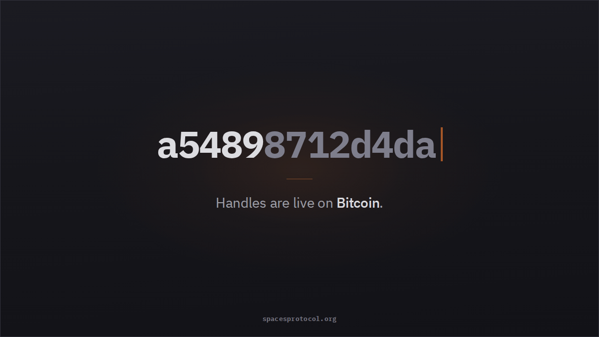
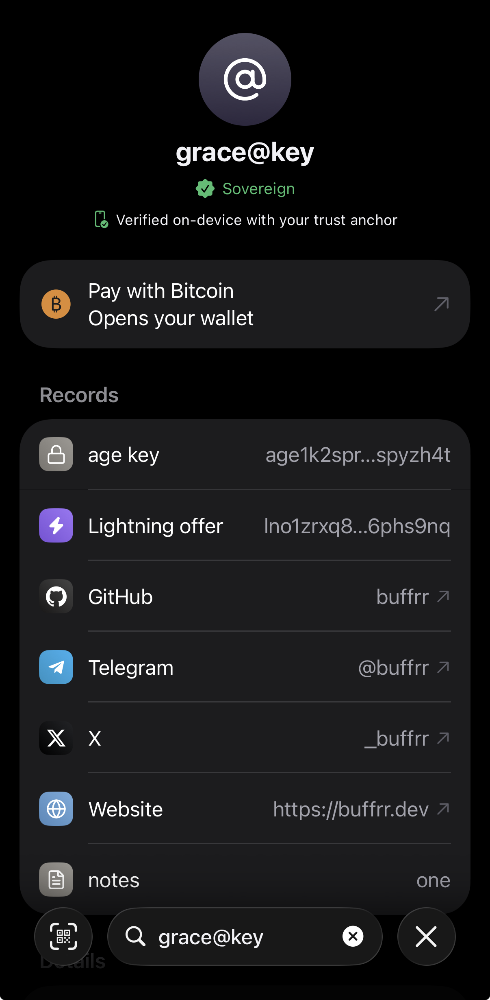

+++
title = "Handles on Mainnet!"
description = "Spaces v0.4.2 ships the off-chain issuance layer to mainnet. The first production operator is @bitcoin, issuing handles through the Nacho app."
date = 2026-09-15

[extra]
og_image = "og-image.png"
+++

Handles are sovereign, irrevocable and permanent anchored to Bitcoin.
Spaces v0.4.2 ships the off-chain issuance layer to mainnet. Operators can now issue handles under a top level space without an on-chain transaction per name, and clients can verify those handles against the Bitcoin anchored root.

The first production operator is `@bitcoin`, issuing handles through the [Nacho app](https://nacho.io) or [atbitcoin website](https://atbitcoin.com).

<a href="https://apps.apple.com/app/id6755894049" class="btn btn-primary"><iconify-icon icon="ph:apple-logo-fill" style="font-size:16px"></iconify-icon> Download for iOS</a>
<a href="https://play.google.com/store/apps/details?id=com.impervious.nacho" class="btn btn-secondary"><iconify-icon icon="ph:google-play-logo-fill" style="font-size:16px"></iconify-icon> Download for Android</a>

## What a Handle Is

A handle looks like `alice@bitcoin`. It binds a human-readable name to a script pubkey, and that binding lives in a Binary Merkle Trie maintained by the operator of the space. The operator periodically commits the root of that tree to Bitcoin as a single 32-byte hash.

What the holder receives is an off-chain certificate containing two proofs: an inclusion proof showing the handle exists in a committed tree, and a non-existence proof showing it was absent from every prior commitment. Together they establish that the name belongs to its holder and never belonged to anyone else.

Certificates do not expire, and the handle remains yours, forever. There is no renewal and no on-chain transaction required to keep a handle.

## Verifying on a Phone

Most decentralized naming requires a full node to verify anything, which is workable on a server and not on the device where names are actually resolved. The Nacho app resolves and verifies handles directly on your device against your own specified trust anchor.

The entire protocol state compresses to a single 32-byte [trust anchor](/docs/use/trust-anchor/). Once a client has that hash, verification is stateless, and a certificate either checks out or it does not.

There are two ways to [derive it yourself](/docs/use/trust-anchor/). The spaces client reads blocks from your own Bitcoin Core node, builds the protocol state locally, and prints the result with `space-cli trust`. Veritas does the same work without a full node, syncing from a checkpoint, verifying Bitcoin's header chain, and scanning only the relevant transactions. 

Once you have the anchor, you scan it into a mobile client, where it remains usable for up to two weeks.

Planned for early 2027 is a ~250 KB recursive STARK proof of the same computation, which provides functionally equivalent security to Veritas desktop app directly on mobile without needing to scan a trust anchor.

## What an Operator Can and Cannot Do

An operator cannot revoke a handle, redirect it, or recover it. Certificates verify independently of whoever issued them. An operator who goes offline, sells the space, or disappears has no effect on existing holders.

The one thing an operator can break is their own ability to issue. An invalid commitment ends a space's issuance permanently, because every subsequent commitment would need to prove non-existence against a broken predecessor. Handles already issued continue to work.

Anyone can become an operator by bidding on and owning a top level space.

## Nacho

Nacho is a mobile client for `@bitcoin` handles, available on iOS and Android. It handles registration, record updates, and resolution, and verifies certificates on-device against a trust anchor the user supplies.

Records such as payment addresses, Nostr pubkeys, and websites are published through Certrelay and touch no on-chain bytes.

Nacho is one operator's implementation. The protocol does not depend on it, and any operator can build their own.

## Getting a Handle

Handles under `@bitcoin` are issued through Nacho, on iOS and Android.

[nacho.io](https://nacho.io)

To try a test handle without buying, the [faucet](/faucet) issues free handles for experimentation.

## Release

v0.4.2 is at [github.com/spacesprotocol](https://github.com/spacesprotocol).

For nerds, read [the paper](https://spacesprotocol.org/paper)
